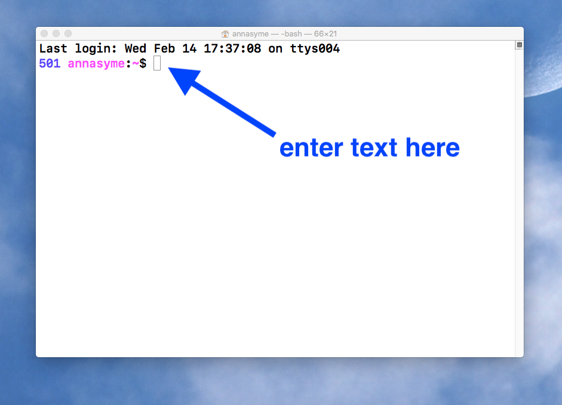

# The commandline - getting started. 

A basic tutorial for beginners, to get started with bioinformatics analyses on the commandline.  

## What is the commandline?

The commandline is a window in which you enter text, to interact directly with your computer. 

It looks like this:  

## How to work on the commandline

### On a Mac

* Go to Applications : Utilities
* Click Terminal
* This opens a window (your terminal). 
* The background may be any colour.
* There will be some information displayed, followed by a $. 
* The $ is called the prompt. 
* You can enter text after the prompt, and press enter. 

### On a PC 

## 

### Two useful commands

* A "command" is something you type that makes something happen. 

### List my files

* Type `ls`
* You should see a list of the folders and files that are present in your current directory

### What directory am I in?

* Type `pwd`
* You should see the name of your current directory, e.g. /Users/Yourname

### Move around

* Type `cd ..`
* This will move you up a level in the directory hierarchy. 
* Type `pwd` again to see where you are

## Next

Try the unix tutorial. 

### Other names for the commandline

* Commandline interface or CLI
* Bash
* The terminal
* The shell

